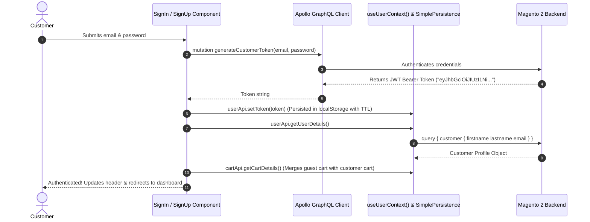

# Magento 2 PWA Studio Customer Account & Auth Developer Guide & Reference

This guide provides the complete developer reference for the **Customer Account & Authentication Pages** in Magento 2 PWA Studio. It covers customer authentication, profile dashboards, order history, address books, wishlists, Peregrine talons, GraphQL queries/mutations, and practical instructions for **updating**, **removing**, or **completely replacing** any part of the customer portal.

---

## Table of Contents
1. [Architecture & Customer Account Routes](#1-architecture--customer-account-routes)
2. [Authentication Flow & Session Management](#2-authentication-flow--session-management)
3. [Internal Sub-Components Breakdown](#3-internal-sub-components-breakdown)
4. [Peregrine Talons, State & GraphQL Operations](#4-peregrine-talons-state--graphql-operations)
5. [How to UPDATE Account Components (With Examples)](#5-how-to-update-account-components-with-examples)
6. [How to REMOVE Account Features (With Examples)](#6-how-to-remove-account-features-with-examples)
7. [How to REPLACE Customer Pages (3 Architectural Approaches)](#7-how-to-replace-customer-pages-3-architectural-approaches)
8. [Full Hands-On Example: Building a 100% Custom Customer Account Portal](#8-full-hands-on-example-building-a-100-custom-customer-account-portal)

---

## 1. Architecture & Customer Account Routes

In PWA Studio, customer account features span dedicated routes and auth modals:

```
Customer Portal Routes:
├── /order-history           -> <OrderHistoryPage />      (Past orders, status, line items)
├── /address-book            -> <AddressBookPage />       (Saved shipping & billing addresses)
├── /account-information     -> <AccountInformationPage />(Name, email, password changes)
├── /wishlist                -> <WishlistPage />          (Saved customer favorites)
└── Auth Modals / Routes:
    ├── /login or /signin    -> <SignIn /> / <SignInPage />
    ├── /create-account      -> <CreateAccount />
    └── /forgot-password     -> <ForgotPassword />
```

---

## 2. Authentication Flow & Session Management



---

## 3. Internal Sub-Components Breakdown

| Component | Source File Path | Responsibility |
| :--- | :--- | :--- |
| `<SignIn />` | `@magento/venia-ui/lib/components/SignIn/signIn.js` | Form with email & password inputs, login submit handler, and forgot password trigger. |
| `<CreateAccount />` | `@magento/venia-ui/lib/components/CreateAccount` | Registration form collecting firstname, lastname, email, password, and newsletter opt-in. |
| `<ForgotPassword />` | `@magento/venia-ui/lib/components/ForgotPassword` | Dispatches password reset link to customer email. |
| `<OrderHistoryPage />`| `@magento/venia-ui/lib/components/OrderHistoryPage` | Lists past orders with order numbers, order date, order progress bar, and order details modal. |
| `<AddressBookPage />` | `@magento/venia-ui/lib/components/AddressBookPage` | Grid of saved address cards with "Set as Default", "Edit", and "Delete" actions. |
| `<AddEditDialog />` | `@magento/venia-ui/lib/components/AddressBookPage/addEditDialog.js` | Modal dialog for creating or updating a customer address. |
| `<AccountInformationPage />`| `@magento/venia-ui/lib/components/AccountInformationPage`| Allows customer to update firstname, lastname, email, and change account password. |
| `<WishlistPage />` | `@magento/venia-ui/lib/components/WishlistPage` | Grid of saved wishlist products with direct "Add to Cart" and item deletion triggers. |

---

## 4. Peregrine Talons, State & GraphQL Operations

### 4.1 `useUserContext` (Global Auth State Hook)
* **Module Path**: `@magento/peregrine/lib/context/user.js`
* **Returns**:
  ```javascript
  const [userState, userApi] = useUserContext();

  const {
      isSignedIn,         // Boolean: true if customer is authenticated
      currentUser: {
          email,          // String
          firstname,      // String
          lastname        // String
      }
  } = userState;

  // Available User Actions:
  // await userApi.setToken(token);      // Saves JWT token & headers
  // await userApi.getUserDetails();     // Refetches customer profile
  // await userApi.signOut();            // Clears token and resets cart session
  ```

### 4.2 `useSignIn` Talon
* **Module Path**: `@magento/peregrine/lib/talons/SignIn/useSignIn.js`
* **Returns**:
  ```javascript
  const {
      errors,             // Form submission errors
      handleSubmit,       // Sign in onSubmit handler
      isBusy,             // Boolean: true during request
      setFormApi
  } = useSignIn({ setDefaultUsername, showToast });
  ```

### 4.3 `useOrderHistoryPage` Talon
* **Module Path**: `@magento/peregrine/lib/talons/OrderHistoryPage/useOrderHistoryPage.js`
* **Returns**:
  ```javascript
  const {
      errorMessage,
      isBackgroundLoading,
      isLoadingWithoutData,
      orders,             // Array of past customer orders
      pageWrapperRef,
      loadMoreOrders      // Pagination fetch callback
  } = useOrderHistoryPage();
  ```

### 4.4 Core Customer GraphQL Queries & Mutations

#### Fetch Customer Profile & Orders:
```graphql
query GetCustomerData {
    customer {
        firstname
        lastname
        email
        addresses {
            id
            firstname
            lastname
            street
            city
            region { region_code }
            postcode
            country_code
            telephone
            default_shipping
            default_billing
        }
        orders(pageSize: 10, currentPage: 1) {
            items {
                id
                number
                order_date
                status
                total {
                    grand_total {
                        value
                        currency
                    }
                }
                items {
                    id
                    product_name
                    product_sku
                    quantity_ordered
                }
            }
        }
    }
}
```

#### Create New Customer Account:
```graphql
mutation CreateAccount($firstname: String!, $lastname: String!, $email: String!, $password: String!) {
    createCustomer(
        input: {
            firstname: $firstname
            lastname: $lastname
            email: $email
            password: $password
            is_subscribed: true
        }
    ) {
        customer {
            email
            firstname
        }
    }
}
```

---

## 5. How to UPDATE Account Components (With Examples)

### Example 5.1: Adding a "My Loyalty Points" Widget to Dashboard
In `local-intercept.js`:
```javascript
const { Targetables } = require('@magento/pwa-buildpack');

module.exports = function localIntercept(targets) {
    const targetables = Targetables.using(targets);

    const accountMenu = targetables.reactComponent(
        '@magento/venia-ui/lib/components/AccountMenu/accountMenu.js'
    );

    // 1. Add LoyaltyBadge import
    accountMenu.addImport(
        "import LoyaltyBadge from '../../../../src/components/LoyaltyBadge'"
    );

    // 2. Insert below customer greeting
    accountMenu.insertAfterJSX(
        '<span className={classes.subtitle}',
        '<LoyaltyBadge />'
    );
};
```

---

### Example 5.2: Adding a Birthday Field to Registration
In `local-intercept.js`:
```javascript
const { Targetables } = require('@magento/pwa-buildpack');

module.exports = function localIntercept(targets) {
    const targetables = Targetables.using(targets);

    const createAccount = targetables.reactComponent(
        '@magento/venia-ui/lib/components/CreateAccount/createAccount.js'
    );

    // Insert date of birth field before submit button
    createAccount.insertBeforeJSX(
        '<Button className={classes.submitButton}',
        `
        <div className={classes.field}>
            <label htmlFor="dob">Date of Birth (Optional)</label>
            <input id="dob" type="date" className={classes.input} />
        </div>
        `
    );
};
```

---

## 6. How to REMOVE Account Features (With Examples)

### Example 6.1: Removing the Wishlist Page Link
In `local-intercept.js`:
```javascript
const { Targetables } = require('@magento/pwa-buildpack');

module.exports = function localIntercept(targets) {
    const targetables = Targetables.using(targets);

    const accountMenuItems = targetables.reactComponent(
        '@magento/venia-ui/lib/components/AccountMenuItems/accountMenuItems.js'
    );

    // Remove the Favorites / Wishlist menu item
    accountMenuItems.removeJSX('<Link to="/wishlist"');
};
```

---

## 7. How to REPLACE Customer Pages (3 Architectural Approaches)

### Method A: Targetables (AST Interception)
* **Best for**: Adding custom tabs (e.g. My Subscriptions, Saved Payment Methods) to existing Venia account menus.
* **File**: `local-intercept.js`

---

### Method B: Webpack Aliasing (Global Replacement)
* **Best for**: Replacing `@magento/venia-ui/lib/components/OrderHistoryPage` or `@magento/venia-ui/lib/components/AddressBookPage`.
* **File**: `webpack.config.js`

```javascript
// webpack.config.js
config.resolve.alias['@magento/venia-ui/lib/components/OrderHistoryPage'] = path.resolve(
    __dirname,
    'src/components/CustomOrderHistory'
);
```

---

### Method C: Standalone Custom Customer Dashboard
* **Best for**: Creating a unified, tabbed customer portal (Profile, Orders, Addresses, Wishlist) on a single responsive `/account` dashboard.

---

## 8. Full Hands-On Example: Building a 100% Custom Customer Account Portal

Here is a complete, copy-pasteable custom Customer Portal featuring:
* Unified Tabbed Navigation: **Profile**, **Order History**, **Address Book**, and **Sign Out**
* Live Customer Data fetching via GraphQL (`GetCustomerDashboardData`)
* Order status tags with formatted dates and grand totals
* Address cards with "Add New Address" modal trigger
* Sign Out execution with session cleanup

### Step 1: Create `src/components/CustomAccount/CustomAccount.js`
```javascript
import React, { useState } from 'react';
import { useQuery, useMutation, gql } from '@apollo/client';
import { Link, useHistory } from 'react-router-dom';
import { useUserContext } from '@magento/peregrine/lib/context/user';
import { useToasts } from '@magento/peregrine';
import classes from './customAccount.module.css';

const GET_CUSTOMER_DASHBOARD = gql`
    query GetCustomerDashboard {
        customer {
            firstname
            lastname
            email
            addresses {
                id
                firstname
                lastname
                street
                city
                region { region_code }
                postcode
                telephone
                default_shipping
            }
            orders(pageSize: 8, currentPage: 1) {
                items {
                    id
                    number
                    order_date
                    status
                    total {
                        grand_total {
                            value
                            currency
                        }
                    }
                    items {
                        id
                        product_name
                        quantity_ordered
                    }
                }
            }
        }
    }
`;

const CustomAccount = () => {
    const history = useHistory();
    const [, { addToast }] = useToasts();
    const [userState, userApi] = useUserContext();
    const { isSignedIn } = userState;

    const [activeTab, setActiveTab] = useState('orders'); // 'orders' | 'profile' | 'addresses'

    const { data, loading, error, refetch } = useQuery(GET_CUSTOMER_DASHBOARD, {
        skip: !isSignedIn,
        fetchPolicy: 'cache-and-network'
    });

    const handleSignOut = async () => {
        try {
            await userApi.signOut();
            addToast({ type: 'info', message: 'You have been signed out successfully.' });
            history.push('/');
        } catch (e) {
            console.error('Sign out error:', e);
        }
    };

    if (!isSignedIn) {
        return (
            <div className={classes.authPrompt}>
                <h2>Please Sign In to View Your Account</h2>
                <p>Access your order history, saved addresses, and profile details.</p>
                <Link to="/login" className={classes.primaryBtn}>Sign In / Register</Link>
            </div>
        );
    }

    if (loading && !data) return <div className={classes.loading}>Loading your account...</div>;

    const customer = data?.customer;
    const orders = customer?.orders?.items || [];
    const addresses = customer?.addresses || [];

    return (
        <div className={classes.root}>
            {/* Header Greeting */}
            <div className={classes.header}>
                <div>
                    <h1 className={classes.greeting}>
                        Welcome back, {customer?.firstname} {customer?.lastname}!
                    </h1>
                    <span className={classes.email}>{customer?.email}</span>
                </div>
            </div>

            <div className={classes.dashboardLayout}>
                {/* Left Sidebar Navigation */}
                <aside className={classes.sidebar}>
                    <button
                        className={`${classes.navTab} ${activeTab === 'orders' ? classes.activeTab : ''}`}
                        onClick={() => setActiveTab('orders')}
                    >
                        📦 Order History ({orders.length})
                    </button>
                    <button
                        className={`${classes.navTab} ${activeTab === 'addresses' ? classes.activeTab : ''}`}
                        onClick={() => setActiveTab('addresses')}
                    >
                        📍 Saved Addresses ({addresses.length})
                    </button>
                    <button
                        className={`${classes.navTab} ${activeTab === 'profile' ? classes.activeTab : ''}`}
                        onClick={() => setActiveTab('profile')}
                    >
                        👤 Profile Details
                    </button>
                    <button className={classes.signOutBtn} onClick={handleSignOut}>
                        🚪 Sign Out
                    </button>
                </aside>

                {/* Right Content Panel */}
                <main className={classes.mainContent}>
                    {/* Tab 1: Orders */}
                    {activeTab === 'orders' && (
                        <div className={classes.tabPane}>
                            <h2 className={classes.paneTitle}>My Orders</h2>
                            {orders.length === 0 ? (
                                <p className={classes.emptyText}>You have not placed any orders yet.</p>
                            ) : (
                                <div className={classes.orderList}>
                                    {orders.map(order => (
                                        <div key={order.id} className={classes.orderCard}>
                                            <div className={classes.orderHeader}>
                                                <div>
                                                    <span className={classes.orderNumber}>Order #{order.number}</span>
                                                    <span className={classes.orderDate}>Placed on {order.order_date}</span>
                                                </div>
                                                <div className={classes.orderMeta}>
                                                    <span className={classes.statusBadge}>{order.status}</span>
                                                    <span className={classes.orderTotal}>
                                                        ${order.total.grand_total.value.toFixed(2)}
                                                    </span>
                                                </div>
                                            </div>

                                            <div className={classes.orderItems}>
                                                {order.items.map(item => (
                                                    <div key={item.id} className={classes.itemRow}>
                                                        <span>{item.product_name}</span>
                                                        <span className={classes.qtyBadge}>x{item.quantity_ordered}</span>
                                                    </div>
                                                ))}
                                            </div>
                                        </div>
                                    ))}
                                </div>
                            )}
                        </div>
                    )}

                    {/* Tab 2: Addresses */}
                    {activeTab === 'addresses' && (
                        <div className={classes.tabPane}>
                            <div className={classes.paneHeader}>
                                <h2 className={classes.paneTitle}>Address Book</h2>
                            </div>

                            <div className={classes.addressGrid}>
                                {addresses.map(addr => (
                                    <div key={addr.id} className={`${classes.addressCard} ${addr.default_shipping ? classes.defaultAddress : ''}`}>
                                        {addr.default_shipping && (
                                            <span className={classes.defaultTag}>Default Shipping</span>
                                        )}
                                        <h4>{addr.firstname} {addr.lastname}</h4>
                                        <p>{addr.street?.join(', ')}</p>
                                        <p>{addr.city}, {addr.region?.region_code} {addr.postcode}</p>
                                        <p>Phone: {addr.telephone}</p>
                                    </div>
                                ))}
                            </div>
                        </div>
                    )}

                    {/* Tab 3: Profile */}
                    {activeTab === 'profile' && (
                        <div className={classes.tabPane}>
                            <h2 className={classes.paneTitle}>Account Information</h2>
                            <div className={classes.profileBox}>
                                <div className={classes.infoGroup}>
                                    <label>First Name:</label>
                                    <span>{customer?.firstname}</span>
                                </div>
                                <div className={classes.infoGroup}>
                                    <label>Last Name:</label>
                                    <span>{customer?.lastname}</span>
                                </div>
                                <div className={classes.infoGroup}>
                                    <label>Email Address:</label>
                                    <span>{customer?.email}</span>
                                </div>
                            </div>
                        </div>
                    )}
                </main>
            </div>
        </div>
    );
};

export default CustomAccount;
```

### Step 2: Create `src/components/CustomAccount/customAccount.module.css`
```css
.root {
  max-width: 1200px;
  margin: 0 auto;
  padding: 40px 16px 80px;
  font-family: var(--font-primary, sans-serif);
}

.header {
  border-bottom: 1px solid #e5e7eb;
  padding-bottom: 24px;
  margin-bottom: 32px;
}

.greeting {
  font-size: 26px;
  font-weight: 700;
  color: #111827;
  margin: 0 0 4px;
}

.email {
  font-size: 14px;
  color: #6b7280;
}

.dashboardLayout {
  display: grid;
  grid-template-columns: 260px 1fr;
  gap: 40px;
}

@media (max-width: 768px) {
  .dashboardLayout {
    grid-template-columns: 1fr;
  }
}

/* Sidebar */
.sidebar {
  display: flex;
  flex-direction: column;
  gap: 8px;
}

.navTab {
  text-align: left;
  background: #f9fafb;
  border: 1px solid #e5e7eb;
  padding: 14px 16px;
  border-radius: 6px;
  font-size: 14px;
  font-weight: 600;
  color: #374151;
  cursor: pointer;
  transition: all 0.2s;
}

.navTab:hover {
  background: #f3f4f6;
}

.activeTab {
  background: #db4444;
  color: #ffffff;
  border-color: #db4444;
}

.signOutBtn {
  text-align: left;
  background: transparent;
  border: 1px solid #ef4444;
  color: #ef4444;
  padding: 14px 16px;
  border-radius: 6px;
  font-size: 14px;
  font-weight: 600;
  cursor: pointer;
  margin-top: 16px;
}

.signOutBtn:hover {
  background: #fee2e2;
}

/* Content Pane */
.mainContent {
  background: #ffffff;
}

.paneTitle {
  font-size: 20px;
  font-weight: 700;
  color: #111827;
  margin: 0 0 20px;
}

/* Order List */
.orderList {
  display: flex;
  flex-direction: column;
  gap: 16px;
}

.orderCard {
  border: 1px solid #e5e7eb;
  border-radius: 8px;
  padding: 20px;
}

.orderHeader {
  display: flex;
  justify-content: space-between;
  align-items: center;
  border-bottom: 1px solid #f3f4f6;
  padding-bottom: 12px;
  margin-bottom: 12px;
}

.orderNumber {
  display: block;
  font-weight: 700;
  color: #111827;
}

.orderDate {
  font-size: 13px;
  color: #6b7280;
}

.orderMeta {
  display: flex;
  align-items: center;
  gap: 16px;
}

.statusBadge {
  background: #dbeafe;
  color: #1e40af;
  font-size: 12px;
  font-weight: 700;
  padding: 4px 8px;
  border-radius: 4px;
  text-transform: uppercase;
}

.orderTotal {
  font-size: 16px;
  font-weight: 800;
  color: #111827;
}

.orderItems {
  display: flex;
  flex-direction: column;
  gap: 8px;
  font-size: 14px;
  color: #4b5563;
}

.itemRow {
  display: flex;
  justify-content: space-between;
}

.qtyBadge {
  color: #6b7280;
  font-weight: 600;
}

/* Addresses */
.addressGrid {
  display: grid;
  grid-template-columns: 1fr 1fr;
  gap: 20px;
}

@media (max-width: 600px) {
  .addressGrid {
    grid-template-columns: 1fr;
  }
}

.addressCard {
  border: 1px solid #e5e7eb;
  border-radius: 8px;
  padding: 20px;
  position: relative;
}

.defaultAddress {
  border-color: #db4444;
  background: #fdf2f2;
}

.defaultTag {
  position: absolute;
  top: 12px;
  right: 12px;
  background: #db4444;
  color: #ffffff;
  font-size: 11px;
  font-weight: 700;
  padding: 2px 6px;
  border-radius: 4px;
}

.addressCard h4 {
  margin: 0 0 8px;
  font-size: 16px;
}

.addressCard p {
  margin: 4px 0;
  font-size: 14px;
  color: #4b5563;
}

/* Profile Box */
.profileBox {
  border: 1px solid #e5e7eb;
  border-radius: 8px;
  padding: 24px;
  display: flex;
  flex-direction: column;
  gap: 16px;
}

.infoGroup {
  display: flex;
  gap: 16px;
  font-size: 14px;
}

.infoGroup label {
  width: 120px;
  font-weight: 600;
  color: #6b7280;
}

.infoGroup span {
  color: #111827;
  font-weight: 500;
}

/* Auth Prompt */
.authPrompt {
  max-width: 500px;
  margin: 80px auto;
  text-align: center;
  padding: 40px 20px;
}

.primaryBtn {
  display: inline-block;
  background: #db4444;
  color: #ffffff;
  text-decoration: none;
  padding: 12px 32px;
  border-radius: 6px;
  font-weight: 600;
  margin-top: 16px;
}
```

---

*Authored for Magento 2 PWA Studio Storefront Development.*
