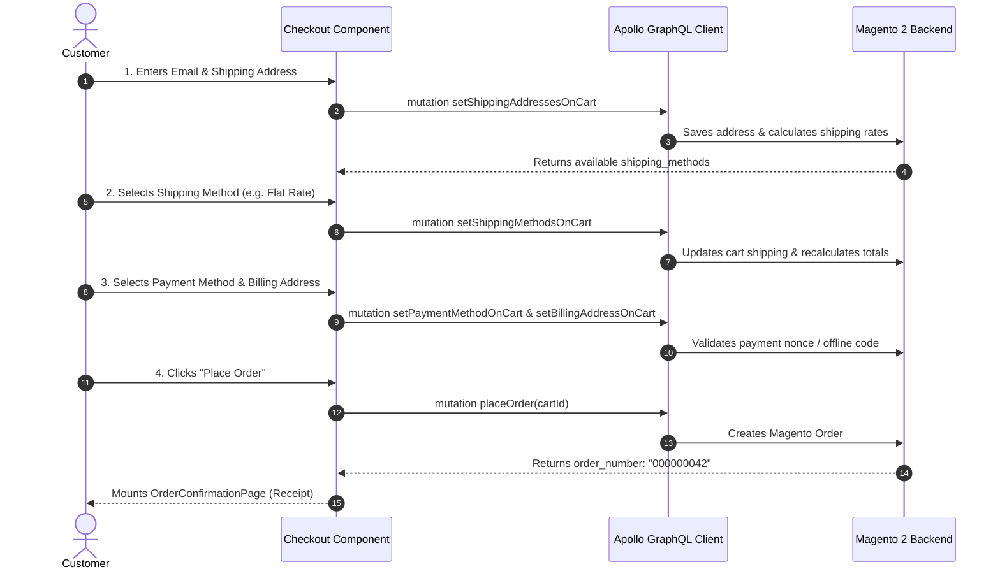

# Magento 2 PWA Studio Checkout Page Developer Guide & Reference

This guide provides the complete developer reference for the **Checkout Page (`/checkout`)** in Magento 2 PWA Studio. It covers the full checkout lifecycle, step-by-step GraphQL mutations, Peregrine talons, payment integrations, and practical instructions for **updating**, **removing**, or **completely replacing** any part of the checkout flow.

---

## Table of Contents
1. [Architecture & Checkout Step Lifecycle](#1-architecture--checkout-step-lifecycle)
2. [Internal Sub-Components Breakdown](#2-internal-sub-components-breakdown)
3. [GraphQL Operations & Mutation Sequence](#3-graphql-operations--mutation-sequence)
4. [Peregrine Talons & State Management](#4-peregrine-talons--state-management)
5. [How to UPDATE Checkout Components (With Examples)](#5-how-to-update-checkout-components-with-examples)
6. [How to REMOVE Checkout Steps/Components (With Examples)](#6-how-to-remove-checkout-stepscomponents-with-examples)
7. [How to REPLACE Checkout Components (3 Architectural Approaches)](#7-how-to-replace-checkout-components-3-architectural-approaches)
8. [Full Hands-On Example: Building a 100% Custom Streamlined Checkout](#8-full-hands-on-example-building-a-100-custom-streamlined-checkout)

---

## 1. Architecture & Checkout Step Lifecycle

In Venia, the checkout is a reactive single-page application orchestrating several asynchronous steps before placing the order.



---

## 2. Internal Sub-Components Breakdown

All checkout components reside in `@magento/venia-ui/lib/components/CheckoutPage/`.

```
<CheckoutPage> (checkoutPage.js)
├── <GuestSignIn />                  (GuestSignIn/guestSignIn.js - prompts guest to login)
├── <ShippingInformation />          (ShippingInformation/shippingInformation.js)
│   ├── <AddressForm />              (Collects name, street, city, state, zip, country, phone)
│   └── <AddressBook />              (For logged-in users: select saved address)
├── <ShippingMethod />               (ShippingMethod/shippingMethod.js - radio list of rates)
├── <PaymentInformation />           (PaymentInformation/paymentInformation.js)
│   ├── <Braintree />                (Card tokenization iframe)
│   ├── <CheckMoneyOrder />          (Offline payment method)
│   └── <BillingAddress />           (Billing address toggle: "Same as shipping")
├── <PriceAdjustments />             (PriceAdjustments/priceAdjustments.js - coupon/giftcard)
├── <OrderSummary />                 (OrderSummary/orderSummary.js - totals, tax, discount)
├── <ItemsReview />                  (ItemsReview/itemsReview.js - collapsed items preview)
└── <OrderConfirmationPage />        (OrderConfirmationPage/orderConfirmationPage.js)
```

| Sub-Component | Responsibility |
| :--- | :--- |
| `<ShippingInformation />` | Manages customer email (for guests) and shipping address collection or selection. |
| `<ShippingMethod />` | Displays available delivery rates (Flat Rate, Express, Free) and saves the selection to cart. |
| `<PaymentInformation />` | Renders active payment methods (Credit Card, PayPal, Check/Money Order) and billing address. |
| `<OrderSummary />` | Computes subtotal, shipping cost, taxes, discount deductions, and grand total. |
| `<PriceAdjustments />` | Collapsible section for applying promo coupon codes or gift cards. |
| `<ItemsReview />` | Shows items in the cart with thumbnails, quantities, and selected options. |
| `<OrderConfirmationPage />`| Rendered after successful order placement with order number, receipt summary, and continue shopping CTA. |

---

## 3. GraphQL Operations & Mutation Sequence

### Step 1: Set Shipping Address & Guest Email
```graphql
mutation SetShippingAddress($cartId: String!, $address: ShippingAddressInput!) {
    setShippingAddressesOnCart(
        input: {
            cart_id: $cartId
            shipping_addresses: [$address]
        }
    ) {
        cart {
            shipping_addresses {
                available_shipping_methods {
                    carrier_code
                    method_code
                    carrier_title
                    method_title
                    amount {
                        value
                        currency
                    }
                }
            }
        }
    }
}
```

### Step 2: Set Shipping Method
```graphql
mutation SetShippingMethod($cartId: String!, $shippingMethod: ShippingMethodInput!) {
    setShippingMethodsOnCart(
        input: {
            cart_id: $cartId
            shipping_methods: [$shippingMethod]
        }
    ) {
        cart {
            prices {
                grand_total {
                    value
                    currency
                }
            }
        }
    }
}
```

### Step 3: Set Payment Method
```graphql
mutation SetPaymentMethod($cartId: String!, $paymentMethod: PaymentMethodInput!) {
    setPaymentMethodOnCart(
        input: {
            cart_id: $cartId
            payment_method: $paymentMethod
        }
    ) {
        cart {
            selected_payment_method {
                code
                title
            }
        }
    }
}
```

### Step 4: Place Order
```graphql
mutation PlaceOrder($cartId: String!) {
    placeOrder(input: { cart_id: $cartId }) {
        order {
            order_number
        }
    }
}
```

---

## 4. Peregrine Talons & State Management

### 4.1 `useCheckoutPage` Talon
* **Module Path**: `@magento/peregrine/lib/talons/CheckoutPage/useCheckoutPage.js`
* **Manages**: Global checkout step states (`CHECKOUT_STEP.SHIPPING_ADDRESS`, `SHIPPING_METHOD`, `PAYMENT`, `REVIEW`).
* **Returns**:
  ```javascript
  const {
      activeContent,          // Current active step view
      checkoutStep,           // Integer step (1: Shipping, 2: Method, 3: Payment, 4: Review)
      handlePlaceOrder,       // Final place order callback
      hasError,               // Boolean
      isCartEmpty,            // Boolean: redirects to cart if true
      isGuestCheckout,        // Boolean
      isLoading,              // Boolean
      orderNumber,            // Order number string upon success
      setCheckoutStep         // Step updater
  } = useCheckoutPage();
  ```

---

## 5. How to UPDATE Checkout Components (With Examples)

### Example 5.1: Adding an "Order Notes / Delivery Instructions" Field
In `local-intercept.js`:
```javascript
const { Targetables } = require('@magento/pwa-buildpack');

module.exports = function localIntercept(targets) {
    const targetables = Targetables.using(targets);

    const checkoutPage = targetables.reactComponent(
        '@magento/venia-ui/lib/components/CheckoutPage/checkoutPage.js'
    );

    // 1. Add Custom Component Import
    checkoutPage.addImport(
        "import OrderNotes from '../../../../src/components/OrderNotes'"
    );

    // 2. Insert above Place Order button
    checkoutPage.insertBeforeJSX(
        '<Button className={classes.placeOrderButton}',
        '<OrderNotes />'
    );
};
```

---

### Example 5.2: Adding a Trust Badge Box into Order Summary
In `local-intercept.js`:
```javascript
const { Targetables } = require('@magento/pwa-buildpack');

module.exports = function localIntercept(targets) {
    const targetables = Targetables.using(targets);

    const orderSummary = targetables.reactComponent(
        '@magento/venia-ui/lib/components/CheckoutPage/OrderSummary/orderSummary.js'
    );

    orderSummary.insertAfterJSX(
        '<PriceSummary isSummary={true} />',
        `
        <div style={{ marginTop: '16px', padding: '12px', background: '#f9fafb', borderRadius: '6px', fontSize: '12px', color: '#6b7280' }}>
            🔒 <strong>256-Bit SSL Encryption</strong>: Your payment details are encrypted and secure.
        </div>
        `
    );
};
```

---

## 6. How to REMOVE Checkout Steps/Components (With Examples)

### Example 6.1: Removing the Guest Sign-In Prompt
If you want a seamless guest checkout without prompting users to sign in:

In `local-intercept.js`:
```javascript
const { Targetables } = require('@magento/pwa-buildpack');

module.exports = function localIntercept(targets) {
    const targetables = Targetables.using(targets);

    const checkoutPage = targetables.reactComponent(
        '@magento/venia-ui/lib/components/CheckoutPage/checkoutPage.js'
    );

    // Remove GuestSignIn banner
    checkoutPage.removeJSX('<GuestSignIn />');
};
```

---

### Example 6.2: Removing the Coupon/Gift Card Section from Checkout
In `local-intercept.js`:
```javascript
const { Targetables } = require('@magento/pwa-buildpack');

module.exports = function localIntercept(targets) {
    const targetables = Targetables.using(targets);

    const checkoutPage = targetables.reactComponent(
        '@magento/venia-ui/lib/components/CheckoutPage/checkoutPage.js'
    );

    // Remove PriceAdjustments (Coupon code accordion)
    checkoutPage.removeJSX('<PriceAdjustments setPageIsCreating={setPageIsCreating} />');
};
```

---

## 7. How to REPLACE Checkout Components (3 Architectural Approaches)

### Method A: Targetables (AST Interception)
* **Best for**: Adding custom checkout fields (e.g. delivery date, gift wrap options).
* **File**: `local-intercept.js`

---

### Method B: Webpack Aliasing (Global Replacement)
* **Best for**: Swapping individual steps like `<ShippingInformation>` or `<PaymentInformation>`.
* **File**: `webpack.config.js`

```javascript
// webpack.config.js
config.resolve.alias['@magento/venia-ui/lib/components/CheckoutPage/PaymentInformation'] = path.resolve(
    __dirname,
    'src/components/CustomPaymentInformation'
);
```

---

### Method C: Standalone Custom Checkout Route
* **Best for**: Building a custom 1-page accordion or 3-step modern checkout without Venia step state constraints.
* **File**: Declare `<Route exact path="/checkout" component={CustomCheckoutPage} />` in your router.

---

## 8. Full Hands-On Example: Building a 100% Custom Streamlined Checkout

Here is a complete, copy-pasteable custom Checkout component featuring:
* Direct contact & shipping address collection
* Shipping method selector (live GraphQL rates)
* Payment method selector (Check/Money Order or Offline Card)
* Live Order Summary with subtotal and grand total
* Final `placeOrder` execution with order receipt view

### Step 1: Create `src/components/CustomCheckout/CustomCheckout.js`
```javascript
import React, { useState } from 'react';
import { useQuery, useMutation, gql } from '@apollo/client';
import { Link, useHistory } from 'react-router-dom';
import { useCartContext } from '@magento/peregrine/lib/context/cart';
import { useToasts } from '@magento/peregrine';
import BrowserPersistence from '@magento/peregrine/lib/util/simplePersistence';
import classes from './customCheckout.module.css';

const GET_CART_DETAILS = gql`
    query GetCartForCheckout($cartId: String!) {
        cart(cart_id: $cartId) {
            id
            email
            total_quantity
            items {
                id
                quantity
                product {
                    name
                    sku
                    small_image {
                        url
                    }
                }
                prices {
                    row_total {
                        value
                        currency
                    }
                }
            }
            prices {
                subtotal_excluding_tax {
                    value
                    currency
                }
                grand_total {
                    value
                    currency
                }
            }
            shipping_addresses {
                available_shipping_methods {
                    carrier_code
                    method_code
                    carrier_title
                    method_title
                    amount {
                        value
                        currency
                    }
                }
                selected_shipping_method {
                    carrier_code
                    method_code
                }
            }
        }
    }
`;

const SET_SHIPPING_ADDRESS = gql`
    mutation SetShipping($cartId: String!, $address: ShippingAddressInput!) {
        setShippingAddressesOnCart(input: { cart_id: $cartId, shipping_addresses: [$address] }) {
            cart {
                id
            }
        }
    }
`;

const SET_SHIPPING_METHOD = gql`
    mutation SetMethod($cartId: String!, $method: ShippingMethodInput!) {
        setShippingMethodsOnCart(input: { cart_id: $cartId, shipping_methods: [$method] }) {
            cart {
                id
            }
        }
    }
`;

const SET_PAYMENT_METHOD = gql`
    mutation SetPayment($cartId: String!, $payment: PaymentMethodInput!) {
        setPaymentMethodOnCart(input: { cart_id: $cartId, payment_method: $payment }) {
            cart {
                id
            }
        }
    }
`;

const PLACE_ORDER = gql`
    mutation PlaceOrderNow($cartId: String!) {
        placeOrder(input: { cart_id: $cartId }) {
            order {
                order_number
            }
        }
    }
`;

const CustomCheckout = () => {
    const history = useHistory();
    const [, { addToast }] = useToasts();
    const [cartState, cartApi] = useCartContext();
    const storage = new BrowserPersistence();
    const cartId = cartState?.cartId || storage.getItem('cartId');

    const [step, setStep] = useState(1); // 1: Shipping, 2: Payment, 3: Success
    const [orderNumber, setOrderNumber] = useState(null);
    const [isSubmitting, setIsSubmitting] = useState(false);

    // Form states
    const [formData, setFormData] = useState({
        email: '',
        firstname: '',
        lastname: '',
        street: '',
        city: '',
        region: 'CA',
        postcode: '90001',
        country_code: 'US',
        telephone: '555-0199'
    });

    const [selectedMethod, setSelectedMethod] = useState('');
    const [selectedPayment, setSelectedPayment] = useState('checkmo');

    const { data, loading, refetch } = useQuery(GET_CART_DETAILS, {
        variables: { cartId },
        skip: !cartId,
        fetchPolicy: 'cache-and-network'
    });

    const [setShipping] = useMutation(SET_SHIPPING_ADDRESS);
    const [setMethod] = useMutation(SET_SHIPPING_METHOD);
    const [setPayment] = useMutation(SET_PAYMENT_METHOD);
    const [placeOrder] = useMutation(PLACE_ORDER);

    const cart = data?.cart;
    const shippingMethods = cart?.shipping_addresses?.[0]?.available_shipping_methods || [];

    const handleAddressSubmit = async (e) => {
        e.preventDefault();
        try {
            setIsSubmitting(true);
            await setShipping({
                variables: {
                    cartId,
                    address: {
                        address: {
                            firstname: formData.firstname,
                            lastname: formData.lastname,
                            street: [formData.street],
                            city: formData.city,
                            region: formData.region,
                            postcode: formData.postcode,
                            country_code: formData.country_code,
                            telephone: formData.telephone,
                            save_in_address_book: false
                        },
                        customer_address_id: null
                    }
                }
            });
            await refetch();
            setStep(2);
        } catch (err) {
            addToast({ type: 'error', message: err.message || 'Error saving address' });
        } finally {
            setIsSubmitting(false);
        }
    };

    const handlePlaceOrder = async () => {
        try {
            setIsSubmitting(true);

            // 1. Set Shipping method
            if (selectedMethod) {
                const [carrier_code, method_code] = selectedMethod.split('__');
                await setMethod({
                    variables: {
                        cartId,
                        method: { carrier_code, method_code }
                    }
                });
            }

            // 2. Set Payment method
            await setPayment({
                variables: {
                    cartId,
                    payment: { code: selectedPayment }
                }
            });

            // 3. Place Order
            const res = await placeOrder({ variables: { cartId } });
            const placedOrderNumber = res.data.placeOrder.order.order_number;

            setOrderNumber(placedOrderNumber);
            setStep(3);

            // Reset cart session
            storage.removeItem('cartId');
            await cartApi.createCart({ fetchCartId: true });
        } catch (err) {
            addToast({ type: 'error', message: err.message || 'Order placement failed' });
        } finally {
            setIsSubmitting(false);
        }
    };

    if (loading && !cart) return <div className={classes.loading}>Loading Checkout...</div>;

    // Order Success Screen
    if (step === 3) {
        return (
            <div className={classes.successContainer}>
                <div className={classes.successCard}>
                    <span className={classes.successIcon}>🎉</span>
                    <h1>Thank you for your purchase!</h1>
                    <p>Your order number is: <strong>#{orderNumber}</strong></p>
                    <p className={classes.subText}>We'll email you an order confirmation with details and tracking info.</p>
                    <Link to="/" className={classes.continueBtn}>Continue Shopping</Link>
                </div>
            </div>
        );
    }

    return (
        <div className={classes.root}>
            <div className={classes.checkoutGrid}>
                {/* Left: Step Form */}
                <div className={classes.formSection}>
                    {/* Step 1: Shipping Address */}
                    <div className={`${classes.stepBox} ${step === 1 ? classes.activeStep : ''}`}>
                        <h2 className={classes.stepTitle}>1. Shipping Address</h2>
                        {step === 1 ? (
                            <form onSubmit={handleAddressSubmit} className={classes.form}>
                                <div className={classes.inputRow}>
                                    <input
                                        type="text"
                                        placeholder="First Name"
                                        required
                                        value={formData.firstname}
                                        onChange={e => setFormData({ ...formData, firstname: e.target.value })}
                                        className={classes.input}
                                    />
                                    <input
                                        type="text"
                                        placeholder="Last Name"
                                        required
                                        value={formData.lastname}
                                        onChange={e => setFormData({ ...formData, lastname: e.target.value })}
                                        className={classes.input}
                                    />
                                </div>
                                <input
                                    type="text"
                                    placeholder="Street Address"
                                    required
                                    value={formData.street}
                                    onChange={e => setFormData({ ...formData, street: e.target.value })}
                                    className={classes.input}
                                />
                                <div className={classes.inputRow}>
                                    <input
                                        type="text"
                                        placeholder="City"
                                        required
                                        value={formData.city}
                                        onChange={e => setFormData({ ...formData, city: e.target.value })}
                                        className={classes.input}
                                    />
                                    <input
                                        type="text"
                                        placeholder="ZIP / Postal Code"
                                        required
                                        value={formData.postcode}
                                        onChange={e => setFormData({ ...formData, postcode: e.target.value })}
                                        className={classes.input}
                                    />
                                </div>
                                <button type="submit" className={classes.primaryBtn} disabled={isSubmitting}>
                                    {isSubmitting ? 'Saving Address...' : 'Continue to Payment →'}
                                </button>
                            </form>
                        ) : (
                            <div className={classes.completedSummary}>
                                <span>{formData.firstname} {formData.lastname} - {formData.street}, {formData.city}</span>
                                <button onClick={() => setStep(1)} className={classes.editBtn}>Edit</button>
                            </div>
                        )}
                    </div>

                    {/* Step 2: Shipping & Payment */}
                    <div className={`${classes.stepBox} ${step === 2 ? classes.activeStep : ''}`}>
                        <h2 className={classes.stepTitle}>2. Delivery & Payment Method</h2>
                        {step === 2 && (
                            <div className={classes.stepBody}>
                                <h3>Delivery Method</h3>
                                <div className={classes.methodList}>
                                    {shippingMethods.map(m => (
                                        <label key={`${m.carrier_code}__${m.method_code}`} className={classes.radioLabel}>
                                            <input
                                                type="radio"
                                                name="shippingMethod"
                                                value={`${m.carrier_code}__${m.method_code}`}
                                                onChange={e => setSelectedMethod(e.target.value)}
                                            />
                                            <span>{m.carrier_title} - {m.method_title} (${m.amount.value})</span>
                                        </label>
                                    ))}
                                </div>

                                <h3>Payment Method</h3>
                                <div className={classes.methodList}>
                                    <label className={classes.radioLabel}>
                                        <input
                                            type="radio"
                                            name="paymentMethod"
                                            value="checkmo"
                                            checked={selectedPayment === 'checkmo'}
                                            onChange={e => setSelectedPayment(e.target.value)}
                                        />
                                        <span>Check / Money Order (Cash on Delivery)</span>
                                    </label>
                                </div>

                                <button
                                    onClick={handlePlaceOrder}
                                    className={classes.placeOrderBtn}
                                    disabled={isSubmitting}
                                >
                                    {isSubmitting ? 'Placing Order...' : 'Place Order Now'}
                                </button>
                            </div>
                        )}
                    </div>
                </div>

                {/* Right: Order Summary */}
                <div className={classes.summarySection}>
                    <div className={classes.summaryCard}>
                        <h2>Order Summary</h2>
                        <div className={classes.itemsList}>
                            {cart?.items?.map(item => (
                                <div key={item.id} className={classes.itemRow}>
                                    
                                    <div className={classes.itemInfo}>
                                        <h4>{item.product.name}</h4>
                                        <span>Qty: {item.quantity}</span>
                                    </div>
                                    <span className={classes.itemPrice}>
                                        ${item.prices.row_total.value}
                                    </span>
                                </div>
                            ))}
                        </div>

                        <div className={classes.totalRow}>
                            <span>Subtotal:</span>
                            <span>${cart?.prices?.subtotal_excluding_tax?.value || '0.00'}</span>
                        </div>
                        <div className={`${classes.totalRow} ${classes.grandTotal}`}>
                            <span>Total:</span>
                            <span>${cart?.prices?.grand_total?.value || '0.00'}</span>
                        </div>
                    </div>
                </div>
            </div>
        </div>
    );
};

export default CustomCheckout;
```

### Step 2: Create `src/components/CustomCheckout/customCheckout.module.css`
```css
.root {
  max-width: 1200px;
  margin: 0 auto;
  padding: 40px 16px 80px;
  font-family: var(--font-primary, sans-serif);
}

.checkoutGrid {
  display: grid;
  grid-template-columns: 1.4fr 1fr;
  gap: 48px;
}

@media (max-width: 860px) {
  .checkoutGrid {
    grid-template-columns: 1fr;
  }
}

.formSection {
  display: flex;
  flex-direction: column;
  gap: 24px;
}

.stepBox {
  border: 1px solid #e5e7eb;
  border-radius: 8px;
  padding: 24px;
  background: #ffffff;
}

.activeStep {
  border-color: #db4444;
  box-shadow: 0 4px 12px rgba(219, 68, 68, 0.08);
}

.stepTitle {
  font-size: 20px;
  font-weight: 700;
  color: #111827;
  margin: 0 0 16px;
}

.form {
  display: flex;
  flex-direction: column;
  gap: 16px;
}

.inputRow {
  display: grid;
  grid-template-columns: 1fr 1fr;
  gap: 16px;
}

.input {
  width: 100%;
  padding: 12px;
  border: 1px solid #d1d5db;
  border-radius: 6px;
  font-size: 14px;
  outline: none;
}

.input:focus {
  border-color: #db4444;
}

.primaryBtn {
  background: #db4444;
  color: #ffffff;
  border: none;
  padding: 14px;
  border-radius: 6px;
  font-size: 15px;
  font-weight: 600;
  cursor: pointer;
  margin-top: 8px;
}

.completedSummary {
  display: flex;
  justify-content: space-between;
  align-items: center;
  font-size: 14px;
  color: #4b5563;
}

.editBtn {
  background: none;
  border: none;
  color: #db4444;
  font-weight: 600;
  cursor: pointer;
  text-decoration: underline;
}

.methodList {
  display: flex;
  flex-direction: column;
  gap: 12px;
  margin: 12px 0 24px;
}

.radioLabel {
  display: flex;
  align-items: center;
  gap: 10px;
  padding: 12px;
  border: 1px solid #e5e7eb;
  border-radius: 6px;
  cursor: pointer;
}

.placeOrderBtn {
  width: 100%;
  background: #111827;
  color: #ffffff;
  border: none;
  padding: 16px;
  border-radius: 6px;
  font-size: 16px;
  font-weight: 700;
  cursor: pointer;
  transition: background-color 0.2s;
}

.placeOrderBtn:hover {
  background: #db4444;
}

/* Summary Section */
.summaryCard {
  background: #f9fafb;
  border: 1px solid #e5e7eb;
  border-radius: 8px;
  padding: 24px;
}

.itemsList {
  display: flex;
  flex-direction: column;
  gap: 16px;
  margin: 20px 0;
  max-height: 320px;
  overflow-y: auto;
}

.itemRow {
  display: flex;
  gap: 12px;
  align-items: center;
}

.itemRow img {
  width: 50px;
  height: 50px;
  object-fit: contain;
  background: #ffffff;
  border-radius: 4px;
}

.itemInfo h4 {
  font-size: 14px;
  margin: 0 0 4px;
  color: #111827;
}

.itemInfo span {
  font-size: 12px;
  color: #6b7280;
}

.itemPrice {
  margin-left: auto;
  font-weight: 600;
  font-size: 14px;
}

.totalRow {
  display: flex;
  justify-content: space-between;
  padding: 10px 0;
  border-top: 1px solid #e5e7eb;
  font-size: 14px;
  color: #4b5563;
}

.grandTotal {
  font-size: 18px;
  font-weight: 800;
  color: #111827;
  border-top: 2px solid #e5e7eb;
}

/* Success Card */
.successContainer {
  max-width: 600px;
  margin: 80px auto;
  text-align: center;
}

.successCard {
  background: #ffffff;
  border: 1px solid #e5e7eb;
  border-radius: 12px;
  padding: 48px 32px;
  display: flex;
  flex-direction: column;
  align-items: center;
  gap: 16px;
}

.successIcon {
  font-size: 54px;
}

.continueBtn {
  background: #db4444;
  color: #ffffff;
  padding: 12px 32px;
  border-radius: 6px;
  text-decoration: none;
  font-weight: 600;
  margin-top: 16px;
}
```

---

*Authored for Magento 2 PWA Studio Storefront Development.*
